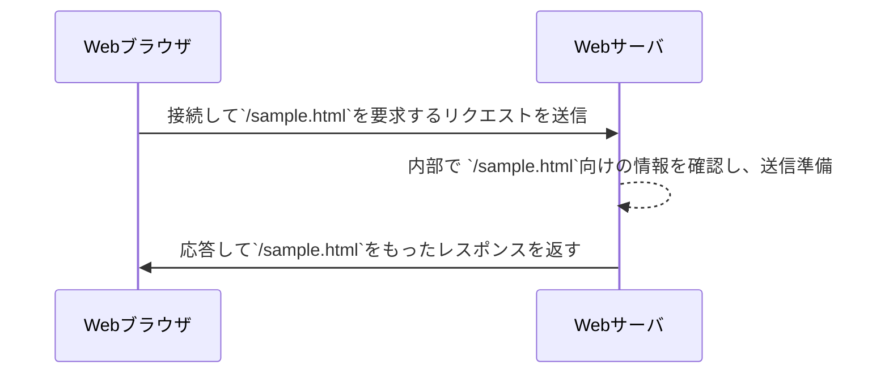

# ラクスインターン用
## [Webサーバ](https://eng-entrance.com/web-server-mechanism)
### クライアントとサーバ
- Webブラウザはクライアント側である。（ユーザ側で動き、情報を取り出すもの）
- サーバはクライアント側が情報を取り出す先である。
- サーバはクライアントからの指示を受け取ってその内容に応じた情報を返す。

上記のことから以下のように認識していればよい
- サービス提供側：サーバ（SERVICE+～ER=SERVER）
- サービスを受ける側:クライアント（お客）

#### リクエストとレスポンス
- クライアントがサーバに送る情報：リクエスト
- サーバがクライアントに送り返す情報：レスポンス

#### 総括
クライアントとサーバではリクエストとレスポンスの送受信が行われており、
Webブラウザが情報を閲覧する先（サーバ）がWebサーバ（Webに関するサービスを提供しているサーバ）という、

### WebサーバとURLの関係
Webブラウザでは、アドレスバーにアドレスが入力される。
このアドレスは**URL**と呼ばれている。
Webブラウザでは、URLを受け取ると、
その内容を確認し、3つの要素に分けて考える

仮に`http://example.com/sample.txt`を入力した場合は以下のようになる。
- `http` → 相手との接続方式として "http" を使うものとする。
-  `com` → 接続先ホストは`localhost`、接続ポート番号は`8080`とする
- 接続できたら、`/sample.html`を要求する

ブラウザーはこの情報を元に
1. サーバーへ接続
2. サーバーから情報を取得できるように要求を送信
3. 結果を受け取って画面に表示

するようになっている。

URLとして接続先ホスト名の後に何も書いていない場合は自動的に末尾に`/`が補われ、
`http://example.com/`として扱われるようになっている。 例えば、今回のケースであれば、`http://example.com`が該当する

サーバーは基本的な動きとして
- 要求に合わせたファイルを準備しておく
- リクエストに応じたファイルを読み込んで内容を返す

これができればよいということ
