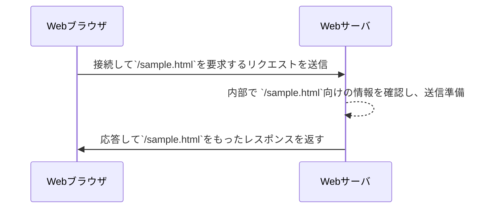

# ラクスインターン用
## [Webサーバ](https://eng-entrance.com/web-server-mechanism)
### クライアントとサーバ
- Webブラウザはクライアント側である。（ユーザ側で動き、情報を取り出すもの）
- サーバはクライアント側が情報を取り出す先である。
- サーバはクライアントからの指示を受け取ってその内容に応じた情報を返す。

上記のことから以下のように認識していればよい
- サービス提供側：サーバ（SERVICE+～ER=SERVER）
- サービスを受ける側:クライアント（お客）

#### リクエストとレスポンス
- クライアントがサーバに送る情報：リクエスト
- サーバがクライアントに送り返す情報：レスポンス

#### 総括
クライアントとサーバではリクエストとレスポンスの送受信が行われており、
Webブラウザが情報を閲覧する先（サーバ）がWebサーバ（Webに関するサービスを提供しているサーバ）という、

### WebサーバとURLの関係
Webブラウザでは、アドレスバーにアドレスが入力される。
このアドレスは**URL**と呼ばれている。
Webブラウザでは、URLを受け取ると、
その内容を確認し、3つの要素に分けて考える

仮に`http://example.com/sample.txt`を入力した場合は以下のようになる。
- `http` → 相手との接続方式として "http" を使うものとする。
-  `com` → 接続先ホストは`localhost`、接続ポート番号は`8080`とする
- 接続できたら、`/sample.html`を要求する


ブラウザーはこの情報を元に
1. サーバーへ接続
2. サーバーから情報を取得できるように要求を送信
3. 結果を受け取って画面に表示

するようになっている。

URLとして接続先ホスト名の後に何も書いていない場合は自動的に末尾に`/`が補われ、
`http://example.com/`として扱われるようになっている。 例えば、今回のケースであれば、`http://example.com`が該当する


サーバーは基本的な動きとして
- 要求に合わせたファイルを準備しておく
- リクエストに応じたファイルを読み込んで内容を返す

これができればよいということ

## [HTML](https://magazine.techacademy.jp/magazine/4843)
## [HTML2](https://magazine.techacademy.jp/magazine/4808)
## [Vue.js](https://reffect.co.jp/vue/beginner-vue/)
### Vue.jsとは
Webサイト、アプリケーションを利用するユーザに対してインタラクティブなUIを提供したいときに利用できる
JavaScriptフレームワーク
今回は**Vite**を使う。Vue.jsを開発する際に元になるプロジェクトを作成することができるツールを使う
Vue.js側は現在、新規でプロジェクトを作成する際にはVue CLIではなく、Viteを利用することを推奨している
今後はプロジェクト作成ツールは Vite をベースに開発が行われていくよう。
ViteでVue.jsのプロジェクト作成するコマンド：`npm init vite@latest . -- --template vue`

`index.html`:最初にブラウザから開発サーバにアクセスすると表示されるのがプロジェクトフォルダ直下にあるhtml ファイル
```html
<!DOCTYPE html>
<html lang="en">
  <head>
    <meta charset="UTF-8" />
    <link rel="icon" type="image/svg+xml" href="/vite.svg" />
    <meta name="viewport" content="width=device-width, initial-scale=1.0" />
    <title>Vite + Vue</title>
  </head>
  <body>
    <div id="app"></div>
    <script type="module" src="/src/main.js"></script>
  </body>
</html>
```

`main.js`
```javascript
import { createApp } from 'vue';
import './style.css';
import App from './App.vue';

createApp(App).mount('#app');
```
1. vue から createApp 関数を import
2. import した createApp 関数を利用して Vue.js のインスタンス
3. インスタンスを作成する際には引数に App.vue ファイルから import した App を指定(App.vue ファイルには見慣れない vue という拡張子)
    拡張子 vue は App.vue ファイルが Vue.js のフォーマットでコードが記述されていることを表しておりこの拡張子を見て内部で適切な処理が行われる。
    vue ファイルの中には Vue.js 特有のフォーマットで中身を記述する必要がある。
4. createApp でインスタンスを作成した後は mount メソッドを実行しています。
    mount メソッドの引数に指定しているのが index.html ファイルに記述されている div 要素の id 属性の app です。
    mount メソッドの処理で id 属性に app を持つ div 要素の中に App.vue ファイルに記述された内容を挿入しています。
    mount の引数の文字列を#app から別の文字列に変更することは可能ですが
    変更した場合は index.html ファイルの id 属性も同じ名前に変更する必要があります。

`App.vue`
```vue
<script setup>
  // This starter template is using Vue 3 <script setup> SFCs
  // Check out https://vuejs.org/api/sfc-script-setup.html#script-setup
  import HelloWorld from './components/HelloWorld.vue';
</script>

<template>
  <div>
    <a href="https://vitejs.dev" target="_blank">
      
    </a>
    <a href="https://vuejs.org/" target="_blank">
      
    </a>
  </div>
  <HelloWorld msg="Vite + Vue" />
</template>

<style scoped>
  .logo {
    height: 6em;
    padding: 1.5em;
    will-change: filter;
  }
  .logo:hover {
    filter: drop-shadow(0 0 2em #646cffaa);
  }
  .logo.vue:hover {
    filter: drop-shadow(0 0 2em #42b883aa);
  }
</style>
```


## [JavaScript](https://jsprimer.net/basic/introduction/)
